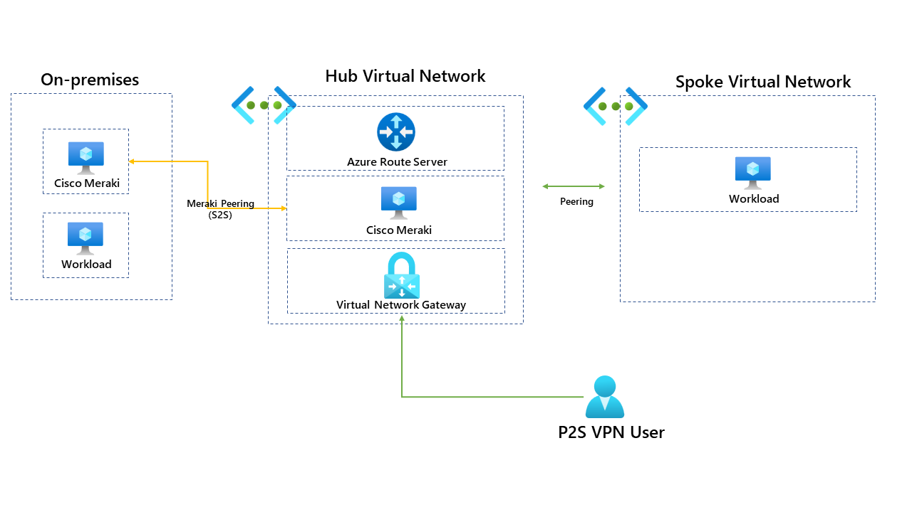
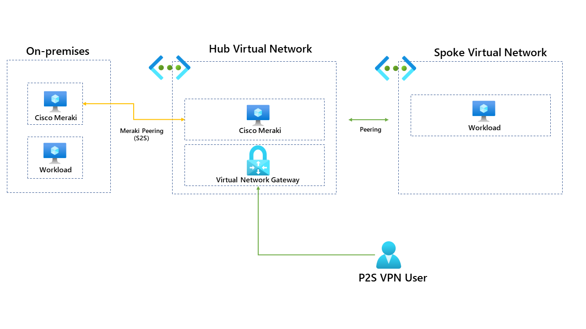
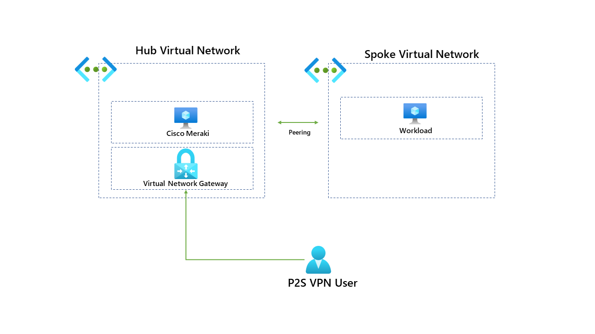
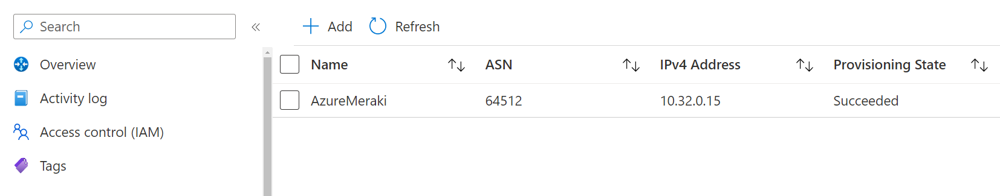
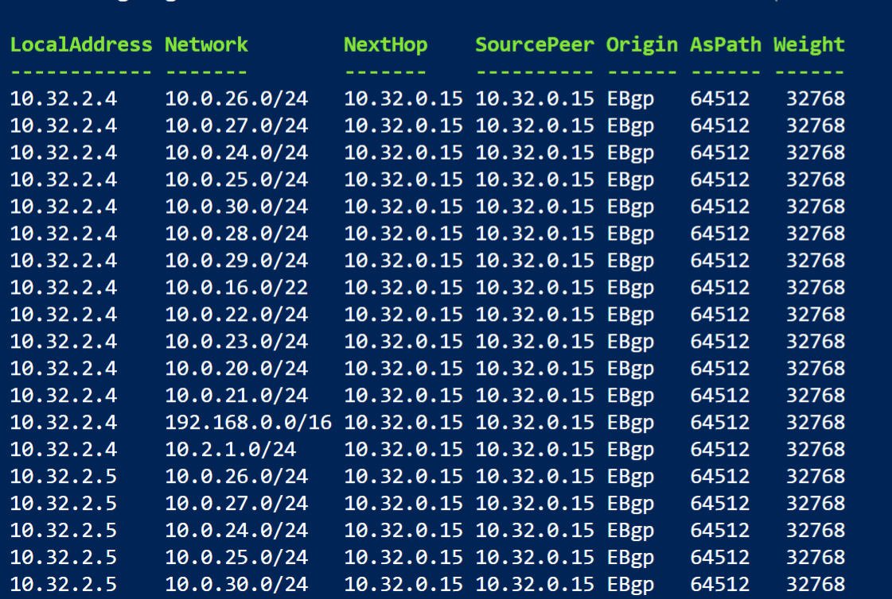
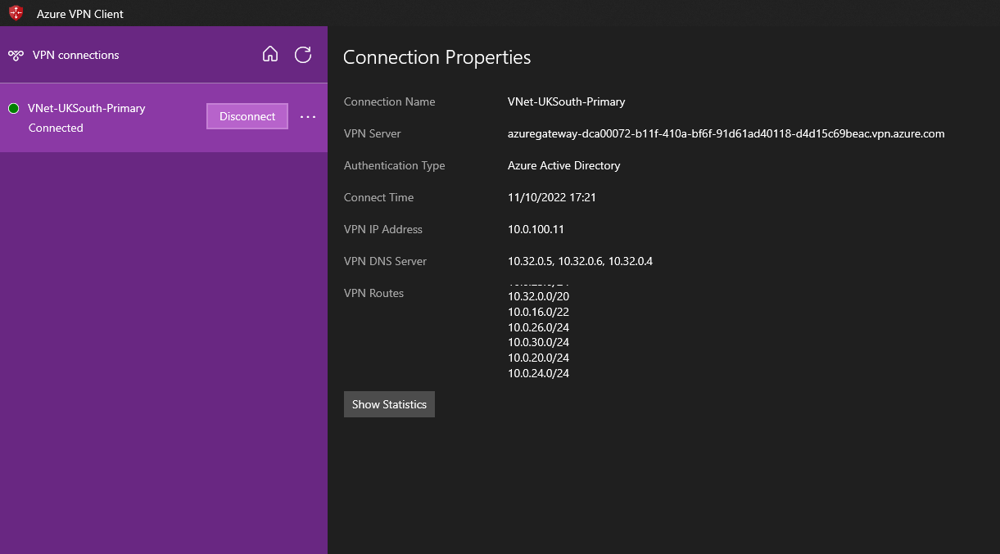

Recently I had a customer who wanted to use Azure VPN Gateway for P2S connections for end-users which would allow them to access Azure resources through a VPN, but they also had a Cisco Meraki NVA in the hub virtual network that connected their Azure region to the head office in the UK. 

One of the requirements for them was to use the P2S connection to access resources in the head office through the Cisco Meraki device. Below is a diagram of the setup before Azure Route Server was implemented. 

In its current setup users connect to the VPN through the P2S connection. Once connected to the VPN, users should have access to workloads running in the hub and the spoke. To make this clear, please see below.     

So how can users connect to on-premises through the Cisco Meraki appliance? This is where Azure Route Server comes in! But firstly what is Azure Route Server? 

Azure Route Server simplifies dynamic routing between your network virtual appliance (NVA) and your virtual network. It allows you to exchange routing information directly through Border Gateway Protocol (BGP) routing protocol between any NVA that supports the BGP routing protocol and the Azure Software Defined Network (SDN) in the Azure Virtual Network (VNet) without the need to manually configure or maintain route tables. 

Azure Route Server is a fully managed service and is configured with high availability. More information can be found here: [What is Azure Route Server? | Microsoft Learn](https://learn.microsoft.com/en-us/azure/route-server/overview)

We will deploy Azure Route Server to the hub virtual network and configure route exchange via BGP with the Cisco Meraki and the Azure Route Server, once this is complete, we can enable the branch-to-branch feature within Azure Route Server this will allow ExpressRoute gateways or VPN gateways to exchange routes with the Route Server, this will need to be enabled to allow the VPN Gateway to learn the routes from the Meraki appliance.  

It's important to note that Azure Route Server requires a dedicated subnet and is PaaS (Platform as a Service) offering from Azure. The route server subnet needs to be called **RouteServerSubnet **and needs at least /27 or a short prefix (such as /26 or /25) or you'll receive an error message when deploying it. 

Once deployed our new topology looks like this: 

Once the Azure Route Server has been deployed, you can find useful information about the IP address and the ASN for it. We will need this information when we come to peer the ARS (Azure Route Server) with the Cisco Meraki. 

We now need to configure the "peering" of the Cisco Meraki with the Azure Route Server, for this, you will need to know the IP address of the Cisco Meraki and its ASN. You will need to do some configuring from Meraki. Cisco provide some excellent documentation that can be found here: 

[vMX and Azure Route Server - Cisco Meraki](https://documentation.meraki.com/MX/Deployment_Guides/vMX_and_Azure_Route_Server)

Once the configuration is complete we can see that the provisioning state of the peering has succeeded.

To view all the routes being learnt from the route server run the following PowerShell command. More information can be found here: 

[Get-AzRouteServerPeerLearnedRoute (Az.Network) | Microsoft Learn](https://learn.microsoft.com/en-us/powershell/module/az.network/get-azrouteserverpeerlearnedroute?view=azps-9.0.1)

    Get-AzRouteServerPeerLearnedRoute

This command will show you all the routes that the Azure Route Server now is learning. You can see that the AsPath which is 64512 which is the Cisco Meraki.

The last remaining step is to enable the branch-to-branch feature within Azure Route Server allowing an ExpressRoute gateway or VPN gateway to learn the advertised routes. This needs to be enabled so that the P2S users can see the routes and access on-premises resources. 

When I am writing this blog post enabling the branch-to-branch feature within the Azure portal doesn't seem to work... but we can bypass this by enabling the feature through PowerShell.

    Update-AzRouteServer -ResourceGroupName $rgname -RouteServerName $routeServerName -AllowBranchToBranchTraffic

Once this is complete we can test the P2S connection from the Azure VPN client and confirm if the routes are now being advertised.

If we compare the routes now being advertised to the routes being advertised by Cisco Meraki, we can confirm that this is successfully working and users can connect to on-premises resources. If this helps please let me know!
